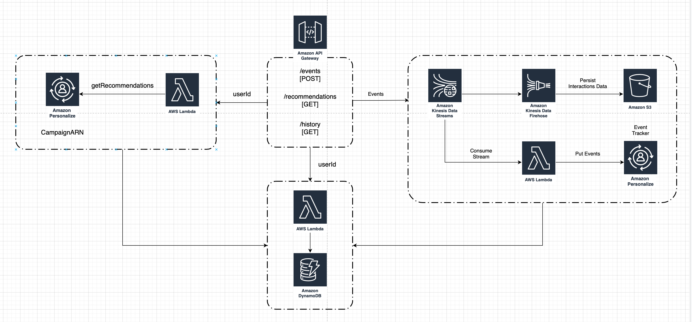

# amazon-personalize-streaming-events
This is a repo that contains code to deploy a sample UI and infrastructure to stream events into an Amazon Personalize event tracker

# Getting Started

This example showcases a key piece you can use to construct your API Layer to consume Amazon Personalize recommendations and produce real time events

As we can see bellow this is the architecture that you will be deploying from this project.

**Note:** The Amazon Personalize Campaigns and Event trackers need to be deployed independently beforehand for you to complete this tutorial. You can deploy your Amazon personalize Campaign by using the following automation example under the MLOps folder, or by leveraging the getting started folder.

## Prerequisites

### Installing AWS SAM

The AWS Serverless Application Model (SAM) is an open-source framework for building serverless applications. It provides shorthand syntax to express functions, APIs, databases, and event source mappings. With just a few lines per resource, you can define the application you want and model it using YAML. During deployment, SAM transforms and expands the SAM syntax into AWS CloudFormation syntax, enabling you to build serverless applications faster.

**Install** the [AWS SAM CLI](https://docs.aws.amazon.com/serverless-application-model/latest/developerguide/serverless-sam-cli-install.html). 
This will install the necessary tools to build, deploy, and locally test your project. In this particular example we will be using AWS SAM to build and deploy only. For additional information please visit our [documentation](https://docs.aws.amazon.com/serverless-application-model/latest/developerguide/what-is-sam.html).

### Create your Personalize Components 

**Create** an Amazon Personalize Campaign and attach an event tracker to it [instructions](https://github.com/aws-samples/amazon-personalize-samples/tree/master/getting_started).

You could also automate this part by leveraging this MLOps [example](https://github.com/aws-samples/amazon-personalize-samples/tree/master/operations/ml_ops)

## Build and Deploy

In order to deploy the project you will need to run the following commands:

1. Clone the Amazon Personalize Samples repo 
    - `git clone https://github.com/aws-samples/amazon-personalize-samples.git`
2. Navigate into the *reference_architectures/personalize-streaming-events* directory
    - `cd reference_architectures/personalize-streaming-events` 
3. Build your SAM project. [Installation instructions](https://docs.aws.amazon.com/serverless-application-model/latest/developerguide/serverless-sam-cli-install.html)
    - `sam build` 
4. Deploy your project. SAM offers a guided deployment option, note that you will need to provide your email address as a parameter to receive a notification.
    - `sam deploy --guided`
5. Enter the S3 bucket where you will like to store your events data, the Personalize Campaign ARN and EventTracker ID.

## Testing the endpoints

- Navigate to the Amazon CloudFormation [console](https://console.aws.amazon.com/cloudformation/home?region=us-east-1)
- Select the stack deployed by SAM
- Navigate to the outputs sections where you will find 3 endpoints:
    1. Get Recommendations Endpoint
    2. Get History Endpoint
    3. Post Events Endopoint

For the GET endpoints you only need to send the userId in the Query Paramaters of the request:

**GET recommendations example:**
`https://XXXXXX.execute-api.us-east-1.amazonaws.com/se-personalize-dev/recommendations?userId=USERID`

**GET history example:**
`https://XXXXXX.execute-api.us-east-1.amazonaws.com/se-personalize-dev/history?userId=USERID`

For the POST endpoint you need so send an event similar to the following in the *body* of the request:

`{&nbsp;
    "Event":{&nbsp;
        "itemId": "ITEMID",&nbsp;
        "eventValue": EVENTV-ALUE,&nbsp;
        "CONTEXT": "VALUE"&nbsp; //optional
    },
    "SessionId": "SESSION-ID-IDENTIFIER",&nbsp;
    "EventType": "YOUR-EVENT-TYPE",&nbsp;
    "UserId": "USERID"&nbsp;
}`

## Next Steps

Congratulations! You have successfully deployed and tested the API layer around your Amazon Personalize deployment.

For additional information on Getting Recommendations please visit our [documentation](https://docs.aws.amazon.com/personalize/latest/dg/getting-recommendations.html)
